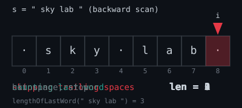

---

# 58. Length of Last Word

---

## **Problem Statement**

Given a string `s` consisting of words and spaces, return the length of the last word in the string.

A **word** is a maximal substring consisting of non-space characters only.

---

## **Example**

**Example 1:**

**Input:**

```plaintext
s = "Hello World"
```

**Output:**

```plaintext
5
```

**Explanation:**

- The last word is "World" with length 5.

**Example 2:**

**Input:**

```plaintext
s = "   fly me   to   the moon  "
```

**Output:**

```plaintext
4
```

**Explanation:**

- The last word is "moon" with length 4.

**Example 3:**

**Input:**

```plaintext
s = "luffy is still joyboy"
```

**Output:**

```plaintext
6
```

**Explanation:**

- The last word is "joyboy" with length 6.

---

## **Constraints**

- `1 <= s.length <= 10^4`
- `s` consists of only English letters and spaces `' '`.
- There will be at least one word in `s`.

---

## **Approach to Solve**

### **Current Approach (trim + split)**

- Trim leading/trailing spaces with `String.trim()`.
- Split the remaining string by spaces with `String.split(" ")`, producing an array of words.
- Return the length of the last element of that array.
- **Time Complexity**: O(n) — `trim` and `split` both walk the whole string.
- **Space Complexity**: O(n) — `split` allocates an array plus a new `String` object for every word found.
- **Issue**: Correct, but wasteful. Building the full array of words is unnecessary when only the last word is needed.

### **Optimized Approach (backward scan, two pointers)**

- Walk the string from the end, skipping trailing spaces first, then counting characters until the next space (or the start of the string) is hit.
- No intermediate array or substrings are created.
- **Time Complexity**: O(n), same asymptotic time but with a smaller constant (single pass, no allocation).
- **Space Complexity**: O(1), no extra data structures.

---

## **Algorithm Explanation (Optimized)**

1. **Initialization**:
    - Start an index `i` at `s.length() - 1` (last character of the string).

2. **Skip Trailing Spaces**:
    - While `i >= 0` and `s.charAt(i) == ' '`, decrement `i`.
    - This positions `i` at the last character of the last word.

3. **Count the Last Word**:
    - Start `len = 0`.
    - While `i >= 0` and `s.charAt(i) != ' '`, increment `len` and decrement `i`.
    - This counts characters until a space is found or the beginning of the string is reached.

4. **Return** `len`, the length of the last word.

---

## **Code Example**

### **Java Solution (Current, trim + split)**

```java
public class LengthOfLastWord {

    public static int lengthOfLastWord(String s) {
        s = s.trim();

        if (s.isEmpty())
            return 0;

        String[] splitedString = s.split(" ");

        return splitedString[splitedString.length - 1].length();
    }
}
```

### **Java Solution (Optimized, two pointers)**

```java
public class LengthOfLastWord {

    public static int lengthOfLastWord(String s) {
        int i = s.length() - 1;

        while (i >= 0 && s.charAt(i) == ' ')
            i--;

        int len = 0;
        while (i >= 0 && s.charAt(i) != ' ') {
            len++;
            i--;
        }

        return len;
    }
}
```

---

## **Why Prefer the Backward Scan?**

- `split(" ")` compiles a regex-like pattern, scans the whole string, and allocates an array plus one `String` per word — all just to throw away every word but the last.
- The backward scan reads only as many characters as needed to find the last word's boundaries, with **no heap allocation** beyond primitives.
- Both approaches are O(n) time, but the two-pointer version is O(1) space versus O(n) space for the split-based version — a meaningful difference on large inputs.

---

## **Visualization**



*(pointer `i` skips trailing spaces in red, then counts the last word in green, stopping gray on the next space)*

**Input**: `s = "   fly me   to   the moon  "`

**Step-by-Step Process (optimized)**:

1. `i` starts at the last index (last trailing space).
2. Skip trailing spaces: `i` moves left until it lands on `'n'` (last char of "moon").
3. Count backward through `"moon"`: `len` becomes 1, 2, 3, 4 as `i` walks over `n`, `o`, `o`, `m`.
4. Hit the space before "moon": stop.
5. **Output**: `4`

---

## **Time and Space Complexity**

- **Current (trim + split)**: Time O(n), Space O(n).
- **Optimized (two pointers)**: Time O(n), Space O(1).

---

## **Additional Notes**

- **Edge Cases**: Single word with no spaces (e.g., `"a"`) → length 1; string with trailing spaces (e.g., `"a "`) must still return the correct last-word length.
- **Why Not Split?**: `split` is simple and correct, but it materializes every word in memory just to discard all but one — unnecessary allocation for a problem that only needs the tail of the string.

---
